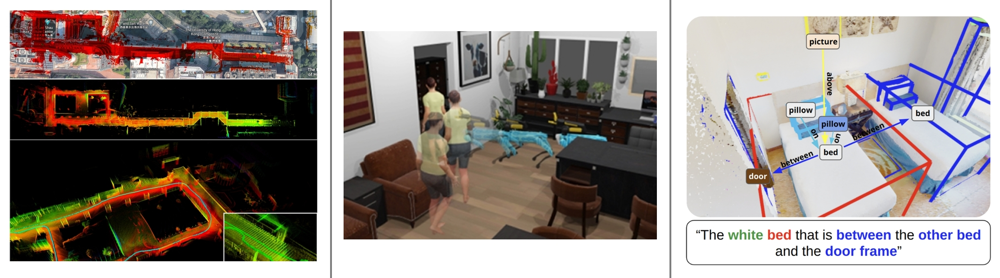
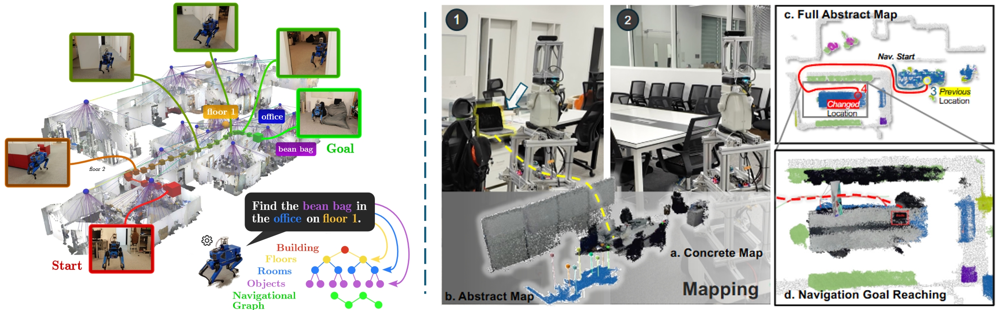
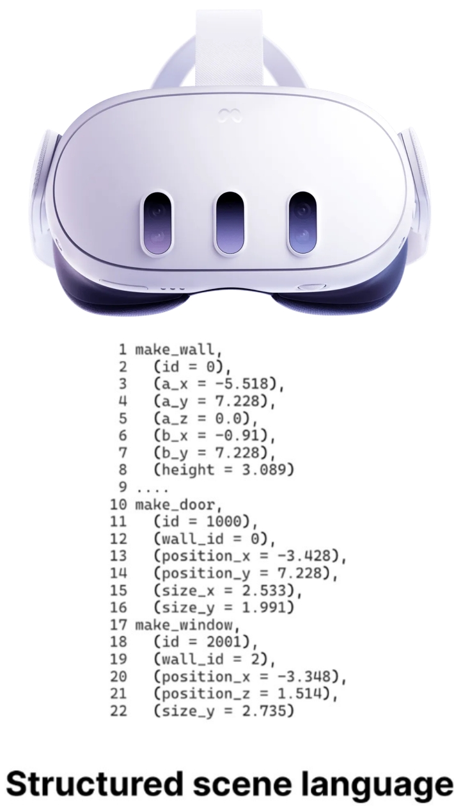
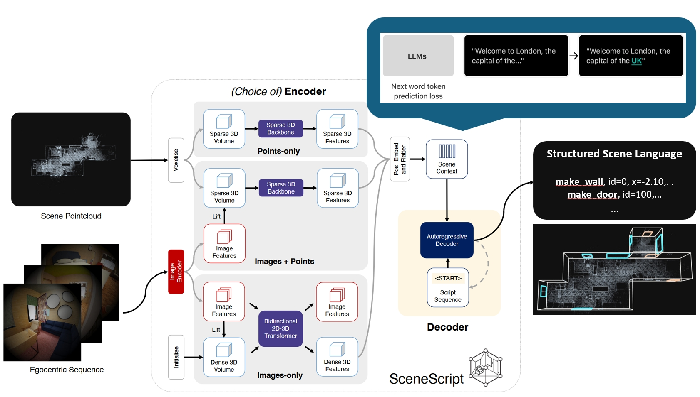
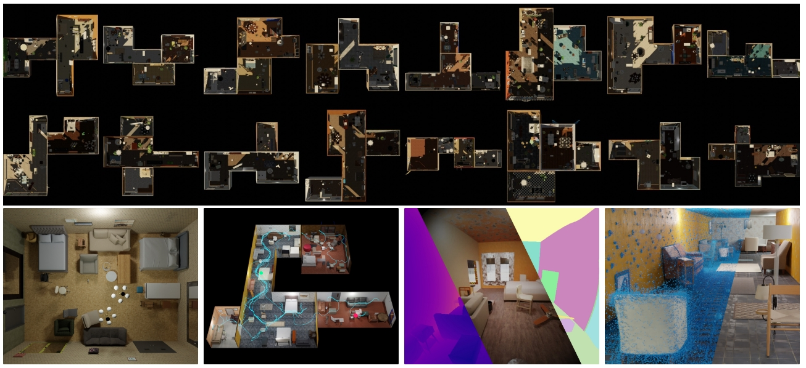
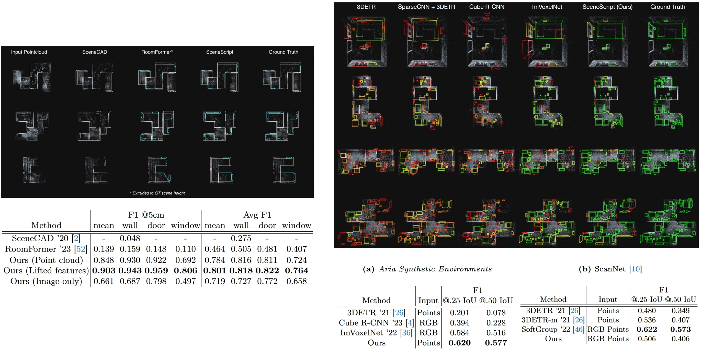
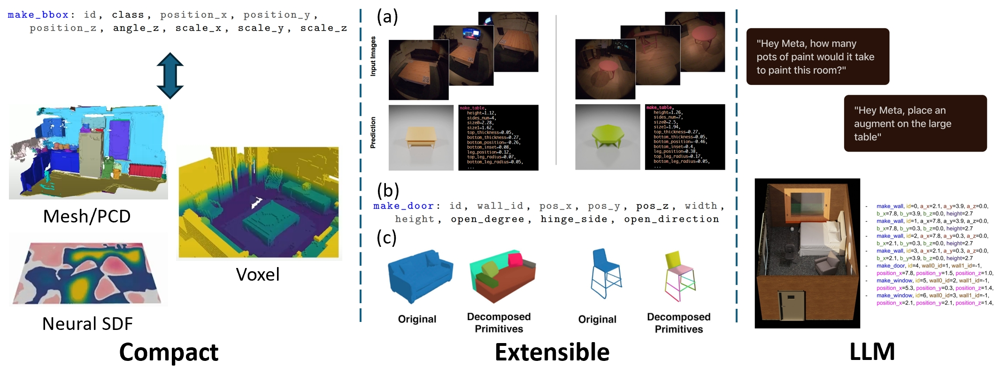
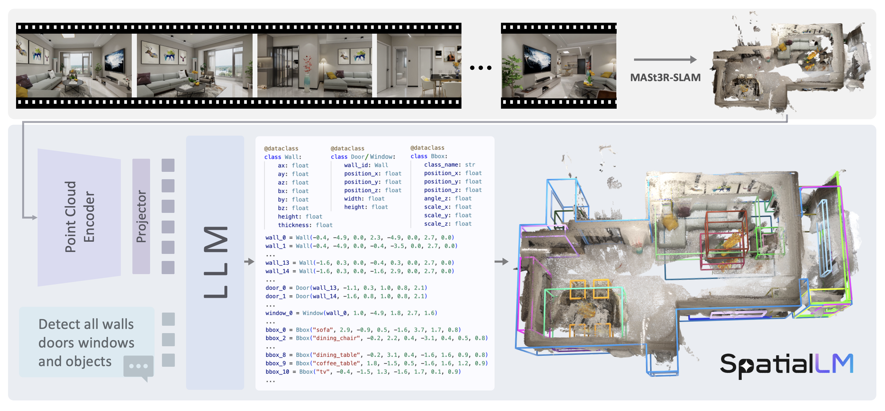
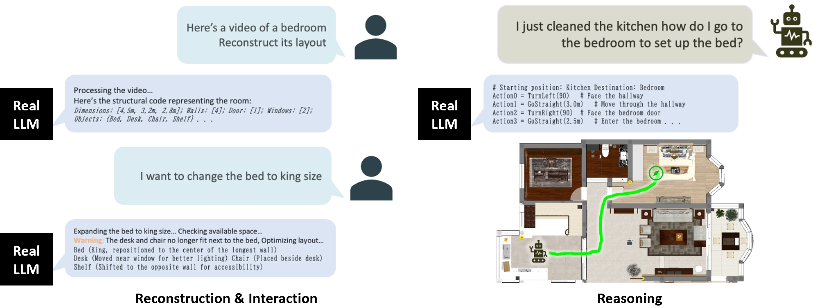

<!-- _class: lead -->

## Language-Based Scene Understanding for Mobile Robot

#### ROAS6800H Seminar 

 

**Yiming ZHU, MPhil's Student**
ROAS, Systen Hub
2025/04/01

---

<!-- _header: Contents -->

1. Background
2. **SceneScript**: Reconstructing Scenes With An Autoregressive Structured Language Model
  _What it is, how to train, experiments, why we need?_
1. Application

---

<!-- _header: Background -->

 

(a) Robust Odometry1&emsp;(b) Complex Scenes2&emsp;(c) Rich Annotations3

> 1: Fast-lio https://ieeexplore.ieee.org/abstract/document/9372856/
> 2: Habitat3.0 https://arxiv.org/abs/2310.13724
> 3: VLA-3D https://arxiv.org/abs/2411.03540

---

<!-- _header: Background -->

- Mainstream methods1 use scene graph to represent a scene.
- Our work DualMap2 aims at real-time language navigation.

> 1: HOV-SG https://arxiv.org/abs/2403.17846
> 2: under review

---

<!-- _header: What is SceneScript? -->

[<u>SceneScript</u>](https://www.projectaria.com/scenescript/) (Meta Reality Labs, ECCV24') is a novel method of **end-to-end** representing scenes using **language**.

  <video controls src="./images/what.mp4" width="800" height="480" title="Example Video"></video>
  

---

<!-- _header: How is SceneScript trained? -->

Similar to next token prediction in LLMs.

---

<!-- _header: How is SceneScript trained? -->

- 3D scene data is not as accessible as web texts for LLM training.
- Synthetic dataset [Aria Synthetic Environments](https://www.projectaria.com/datasets/ase/) with 100K scenes.

---

<!-- _header: Experimental Results -->

The authors tested the performance of SceneScripts on layout estimation & object detection.

---

<!-- _header: Why SceneScript? -->

Low memory, extensibility and integration with language models.

---

<!-- _header: Application -->

[SpatialLM](https://manycore-research.github.io/SpatialLM/) uses the pointcloud encoder of SceneScript. It validates the SceneScript's compatibility with LLM.

---

<!-- _header: Application -->

- Spatia"lLM" means Large Language Model, which is **over-claimed**.
- But it inspires us about future directions.

---

<!-- _header: Block Test -->

This is a test for blocks.

  
Key Point

  
<strong>The next generation of robots</strong> will need to build <strong>metric-semantic</strong> representations of environments, enriched with <strong>inter-object relations</strong> and <strong>human-in-the-loop</strong> capabilities.

They looks all set.

---

<!-- _class: lead -->
## Thank you!

> \* Slides made with [Marp](https://github.com/marp-team/marp) and [kaisugi](https://github.com/kaisugi/marp-theme-academic).