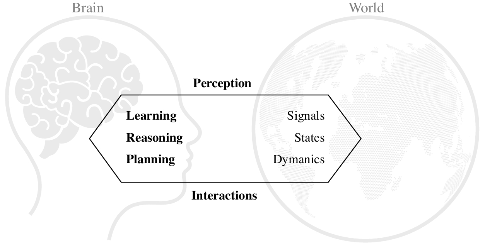
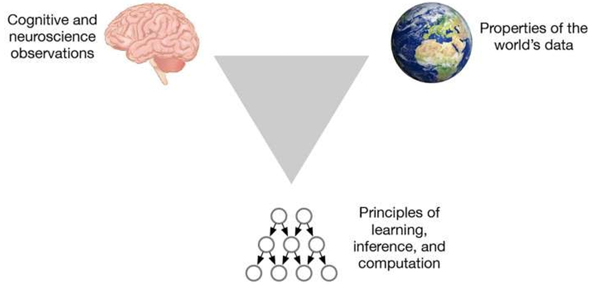
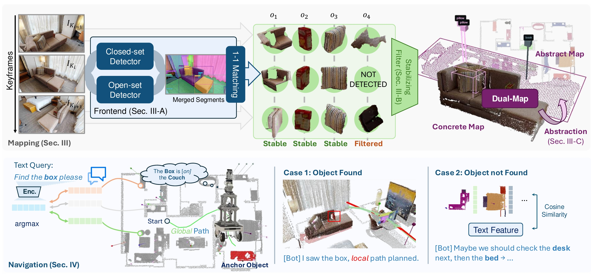
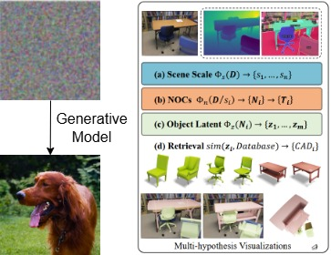
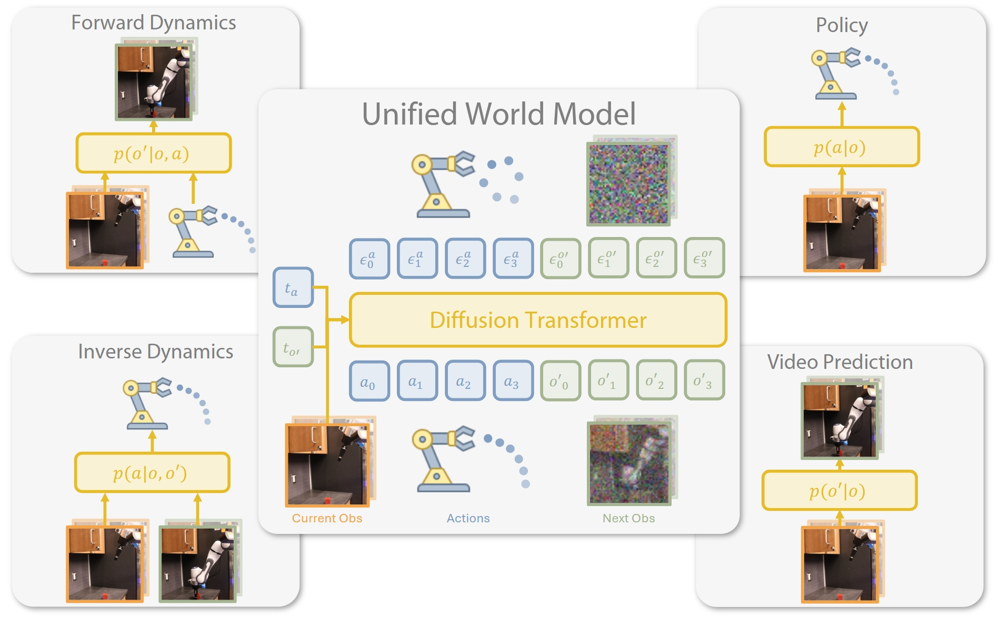
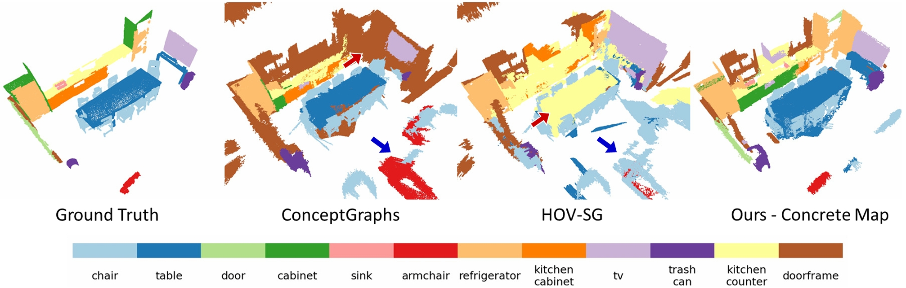
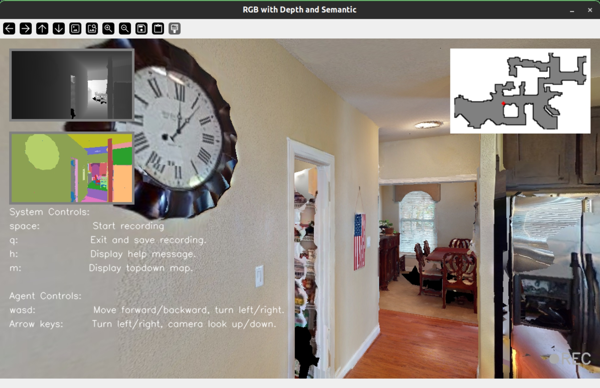

<!-- _class: lead -->

## Language-Based Scene Understanding for Mobile Robot

#### UCMP6050 Assignment 5

 

**Yiming ZHU, MPhil's Student**
ROAS, Systen Hub
2025/04/14

---

<!-- _header: Overview and Objectives -->

How can we build a robot with human-like abilities in understanding and interacting with its environment?

Fig. 1 How humans interact with world1.

Fig. 2 Triangulation strategy2.

  
Environment Intelligence

  
Environmental intelligence refers to human-like, holistic 3D scene understanding that integrates <strong>perception, interaction, learning, and reasoning</strong>.
  

> 1: Doctoral Thesis by Siyuan Huang: [Human-like Holistic 3D Scene Understanding](https://escholarship.org/uc/item/48n146z7)
> 2: [From CAPTCHA to Commonsense: How Brain Can Teach Us About Artificial Intelligence](https://www.frontiersin.org/journals/computational-neuroscience/articles/10.3389/fncom.2020.554097/full)

---

<!-- _header: Research Method -->

DualMap1 is designed for **semantic mapping** and **language-based navigation**.
- Frontend (open-set detection) + Backend (stability filter and DualMap building)
- Text query $\rightarrow$ CLIP feature $\rightarrow$ find matching object $\rightarrow$ Navigating

> 1: Online Open-Vocabulary Semantic Mapping for Natural Language Navigation in Dynamic Changing Scenes, under review

---

<!-- _header: Research Method -->

Diffusion models have shown strong capabilities in learning data distributions for image generation and 3D reconstruction tasks. 
They have also been applied to robotic manipulation, such as in Diffusion Policy3. This raises an question: **Can diffusion models also enhance robotic perception?**

Fig. 1 What are diffusion models1?

Fig. 2 Unified World Model2, RSS2025.

> 1: [DiffCAD: Weakly-Supervised Probabilistic CAD Model Retrieval and Alignment from an RGB Image](https://dl.acm.org/doi/10.1145/3658236)
> 2: [Unified World Models: Coupling Video and Action Diffusion for Pretraining on Large Robotic Datasets](https://arxiv.org/abs/2504.02792)
> 3: [3D Diffusion Policy: Generalizable Visuomotor Policy Learning via Simple 3D Representations](https://arxiv.org/abs/2403.03954)

---

<!-- _header: Progress and Future Plan -->

The last milestone achieved is shown as Fig. 1, simulation building is on track.

Fig. 1 Comparison on ScanNet dataset.

Fig. 2 Simulation env(debugging).

| Due Date    |Milestones                                 |
|-------------|---------------------------------------------|
| 2025-04-20  | Fine-tuning RDT-1B to validate diffusion based model.    |
| 2025-04-27  | Finalize "diffusion map" idea.        |
| 2025-05-05  | Habitat-Sim based simulation built.    |
